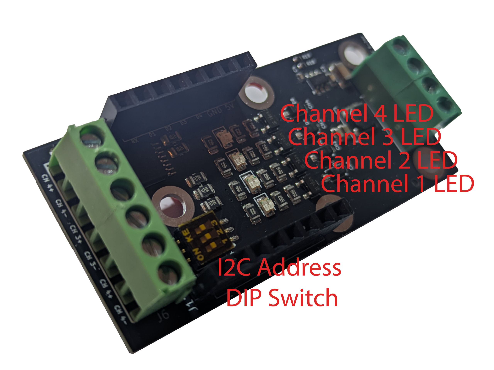

# Wemos D1 Mini Shield - 4 Channel MOSFET Relay via I2C (6-30V)

   

This repository contains the sample YAML file to use with the "Wemos D1 Mini Shield - 4 Channel MOSFET Relay via I2C (6-30V)" shield. 

In order to use the shield, follow the steps below:

1.1 Edit the following parameters to directly connect your Wemos D1 Mini upon boot to your Wifi network:
>WIFINAME
>
>WIFI_PASSWORD

1.2 (Optional) Edit the OTA_PASSWORD to allow Over-the-Air updates via Home Assistant, if necessary.

1.3 (Optional) Edit the AP_PASSWORD to connect to allow for remote connections to the AccessPoint of the Wemos D1 Mini in case the WiFi network from step 1.1 is not available.

1.5 (Optional) Edit the "address: 0x27" parameter of the pca9554 component and flip the DIP switch accodingly, if you want to change the address. The default is 0x27 (dip switch: 111), no change is needed for the board to work.

2 Attach your Wemos D1 Mini shield via USB to your computer and run ESPHome with the adjusted YAML file to flash your Wemos D1 Mini:
>esphome run 4ChRelay.yaml

3 Once flashing is done, attach your Wemos D1 Mini to the shield (pay attention to the correct orientation, 5V PIN is indicated on the shield and on the Wemos D1 Mini or have a look at the product pictures). Supply the shield with 6-30V, depending on the devices you would like to control via the relays. Do not connect USB and shield power input at the same time!

HomeAssistant will detect a new ESPHome instance with 4 switches:
HA Module 4ChRelay - Relay 1
HA Module 4ChRelay - Relay 2
HA Module 4ChRelay - Relay 3
HA Module 4ChRelay - Relay 4

